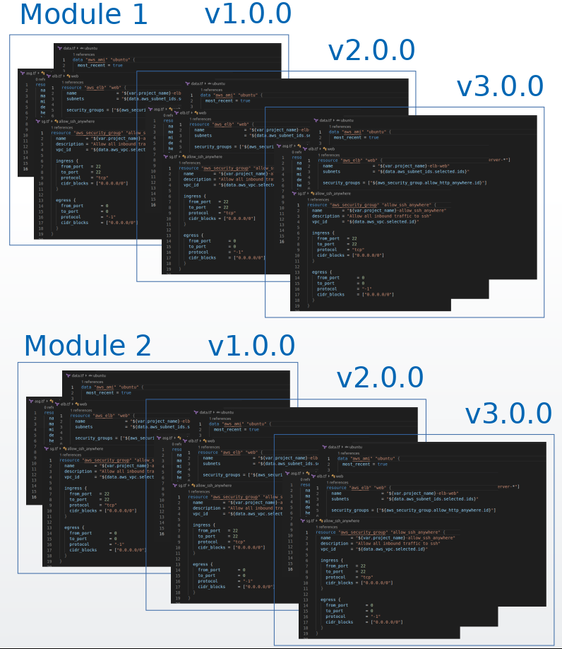

# Terraform templates and modules
This is the first thing we need.

If we start working with Terraform, we will soon discover the modules and realize that it is the best way to reuse our work. As we improve our modules, we will be able to version them and we will always know exactly what source code we are using to create our infrastructure.



In the modules we will also have variables or input parameters (the inputs) and output variables with information about the infrastructure created (the outputs).

Operations teams are probably already working like this, with modules, and this is still going to be like that, it is not necessary for operations teams to change the way they work to manage infrastructure deployments with XL Deploy.

In this tutorial, we are going to use the following module:

https://registry.terraform.io/modules/jclopeza/java-bdd-project

## `Java Bdd Project` module
This Terraform module will be used for projects with a Java component (or a front running in Tomcat on port 8080) and with a database component.

It will create a VPC, with a public subnet and two EC2 instances. One of them with access to ports 22 and 8080 (front side) and the other one with access to ports 22 and 3306 (database side).

This module is parameterized because I want to reuse it to provision multiple environments. The variables it accepts can be seen here:

https://registry.terraform.io/modules/jclopeza/java-bdd-project/module/2.0.0?tab=inputs

And as output I will get, among other variables, the public IP addresses of the two EC2 instances that have been created.

https://registry.terraform.io/modules/jclopeza/java-bdd-project/module/2.0.0?tab=outputs

We assume that these files have been created by the right teams, have been reviewed, approved, versioned and published in the Terraform registry for later use. These modules comply with the best practices and meet the security requirements.

## How to use this module?
To use this module that is published in the Terraform registry, it will be enough to create the following Terraform templates:

A file with the input variables

`variables.tf` file
```
variable "aws_region" {}
variable "environment" {}
variable "instance_type" {}
variable "public_key_path" {}
variable "private_key_path" {}
variable "project_name" {}
```

Another one with the output variables

`outputs.tf` file
```
output "public_ip_front" {
  value = "${module.java-bdd-project.public_ip_front}"
}
output "public_ip_bdd" {
  value = "${module.java-bdd-project.public_ip_bdd}"
}
output "environment" {
  value = "${var.environment}"
}
output "private_key_path" {
  value = "${var.private_key_path}"
}
```

And another one with the name of the module we want to use, the version and the parameters.

`terraform.tf` file
```
module "java-bdd-project" {
  source  = "jclopeza/java-bdd-project/module"
  version = "2.0.0"
  aws_region = "${var.aws_region}"
  environment = "${var.environment}"
  instance_type = "${var.instance_type}"
  project_name = "${var.project_name}"
  public_key_path = "${var.public_key_path}"
  private_key_path = "${var.private_key_path}"
}
```

Now, how do we launch these templates? From which host, with what parameters, how do we manage them?

Well, we are going to take these files to XL Deploy and we are going to create the necessary parameters to be able to reuse our modules and provision different environments.