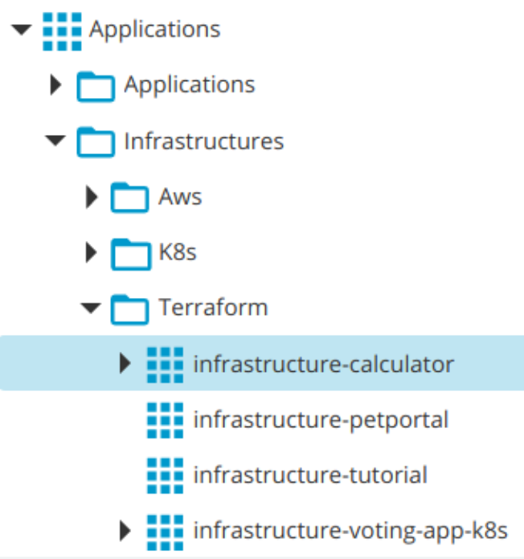

# Where to store these templates?
First, I will need to create infrastructures on Amazon for different applications or projects, therefore, I will have an udm.Application (infrastructure application) for each project that I want to provision. For example, I will have an infrastructure application for the 'calculator' project (what it will actually do is provision the infrastructure for the development, pre-production and production environments for the 'calculator' project), another infrastructure application for the 'petportal' project, etc.



We also have to be able to choose the version of the module that we want to use, therefore, we should have as many versions available in XL Deploy as versions we have of the module in the Terraform registry or in the Git repository.


## What does each of these versions of XL Deploy contain?

It will have a component of type 'terraform.Module' that will be nothing more than a zip file with the three templates that we saw before: `variables.tf`, `outputs.tf` and `terraform.tf`. One with the input variables, another one with the outputs and another one that will be in charge of calling the correct version of the module that we are going to use.


In this case we see that version 2.0.0 in XL Deploy will use the module in version 2.0.0.

Within this component I also have the 'Input Variables' section, in which I can register those variables that I need to complete when I use the module.


If we notice, I am not assigning fixed values but placeholders. I will configure the values in dictionaries and I will assign those dictionaries to each of the environments that I want to provision for a given project, which will typically be development, pre-production and production.

We will also have two templates, two XL Deploy templates to create two new hosts (infrastructure items) with the values to access the newly created EC2 instances.


## Loading the Terraform templates into XL Deploy

Now, how can we create these versions in XL Deploy?

Very easy, the only thing we need are the three Terraform templates necessary to call the module (they were the file of inputs or variables, the file of outputs, and the file in which I define the Terraform module and the version I want to use).

If I also want to feed XL Deploy automatically, I will need a yaml file in which I describe our application in a language that XL Deploy understands.

In this yaml file I can see that I am creating a new 'deployment package', which will have a component of type 'terraform.Module' with a series of input variables, and that the Terraform templates I want to load are in the 'artifacts' directory.


Now let's imagine that the operations team evolves the module and creates version 5.0.0. To be able to use this new version from XL Deploy the only thing we would have to do would be:

1. Modify the template indicating the new version of the module
2. Adjust the input and output variables if necessary
3. Execute the command 'xl apply' passing certain variables (because the yaml file also contains certain variables)

You can use the next git repository and the next code:

```
$ git clone https://github.com/jclopeza/xl-deploy-apps.git
$ cd xl-deploy-apps/application-infrastructure-java-bdd-project
$ xl apply -f app.yaml --values project=petportal,version=1.0.0
```

This will create a new application named 'infrastructure-petportal' under the 'Infrastructures' directory and will create the Deployment Package named 1.0.0.

```
Applications
└── Infrastructures
    └── infrastructure-petportal
        └── 1.0.0
            ├── infrastructure-petportal
            ├── template-host-bdd
            └── template-host-front
```

**This we have just seen is very important. The XebiaLabs DevOps platform not only allows me to have our application described as code as we have just seen, but we can also describe all our infrastructure, our environments and our configurations declaratively in yaml files. XL Deploy is the only tool that allows us to declaratively describe all the types of resources necessary for the deployment of any type of application, of any technology in any type of environment.**

This version of our infrastructure will have a single component of type 'terraform.Module' and will have defined 'Variable Inputs':
* aws_region
* environment
* instance_type
* project_name
* public_key_path
* private_key_path

But the value of these variables is not defined, instead, we have put some 'placeholders' which is what will allow me to reuse this same version of my infrastructure to provision various environments. I will manage this through dictionaries, in them I will store the configuration and the different values that I will apply to the development, pre-production and production environments.


In addition to the terraform.Module component, we have associated two templates. Why?, well, when we apply the Terraform templates, two new EC2 instances will be created on Amazon, which we will be using later to install software, applications, etc. Each of these instances will have an IP address and the public key that we have passed as a parameter.

With the templates that we have associated, two infrastructure CIs of kind overthere.SshHost will automatically be created in XL Deploy ready to be used and associated with deployment environments.