# How to execute these templates?
Well, we already have our application with the different versions referring to the different versions of the Terraform modules.

Now we need to apply them somehow. We will need a host from which to execute the commands, an AWS account, a directory in which to store the 'Terraform state' file, etc.

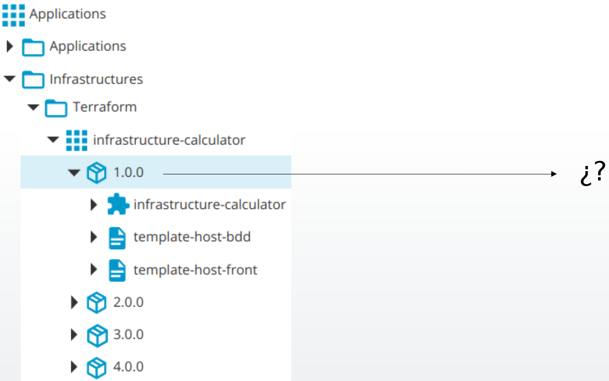

## Creating the hosts

The first thing we are going to create in XL Deploy are the hosts on which we have the Terraform client installed and from which we want to execute 'terraform apply' to create our infrastructure. For our example, I am going to imagine that my organization has three hosts enabled to run Terraform templates, each one configured with an AWS account and each one with a different objective. One will serve to create infrastructures for development environments, another host will serve to create infrastructures for pre-production environments, and another one will create infrastructures for production environments.

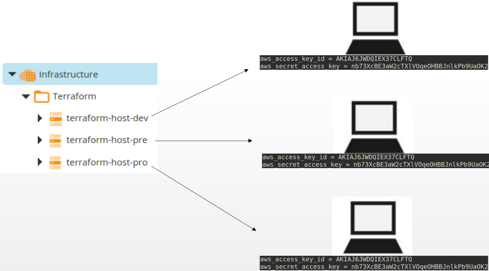

For each of them I have to setup their IP address, the user to do the login and their private key. I remember that the access credentials to all our infrastructure can be managed directly with XL Deploy, where all sensitive information will be stored encrypted, or it can be managed with tools such as Hashicorp Vault or Ciberark. XL Deploy integrates with them.

## Creating the Terraform clients

The next thing we need are Terraform clients.

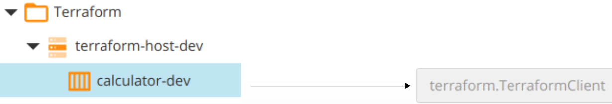

We will have to indicate in which path is the binary 'terraform'.

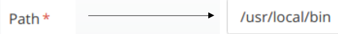

And which working directory to use. **It is in this working directory where the status file will be located after applying the infrastructure.** Therefore, we will need to register as many 'Terraform Clients' as infrastructures we want to create. Why?, because each of these 'Terraform Clients' will be assigned with a unique directory in which to store and update the 'Terraform state' file. In our example, I'm going to choose the directory name depending on the name of the project and the environment I'm provisioning. So, to provision a development environment for the 'calculator' project I will configure the directory
/var/opt/xebialabs/terraform-states/calculator-dev.

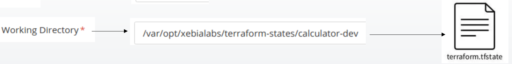

That is where I will store the 'Terraform state' file. To name the Terraform client I will follow the same criteria, in this case, the name will be 'calculator-dev'.

If I wanted to manage development, pre-production and production infrastructures for the calculator, petportal and voting-app projects, I would have the following Terraform clients. Each client configured under the corresponding server.

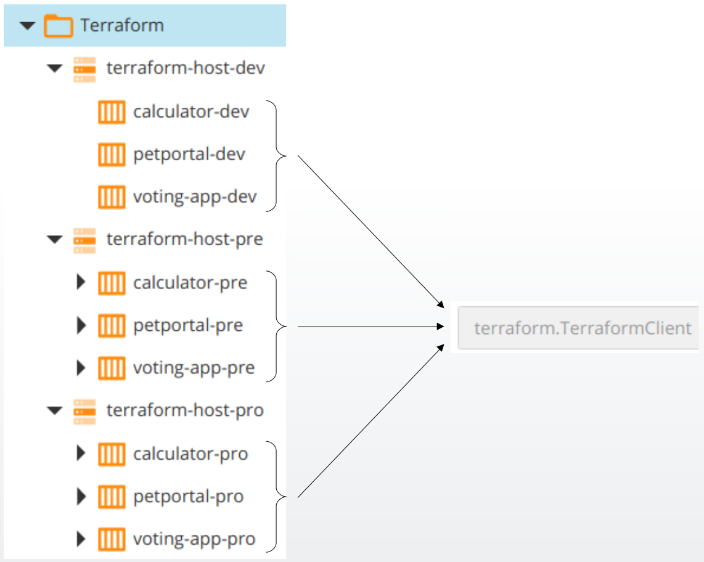

And each client, with its associated working directory to store the 'Terraform state' file.

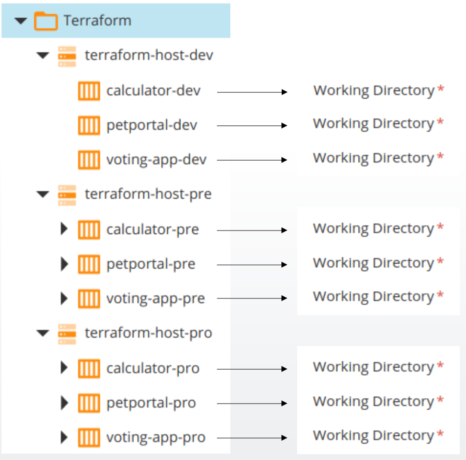

You can use the next yaml file to create this infrastructure
```
---
apiVersion: xl-deploy/v1
kind: Infrastructure
spec:
- directory: Infrastructure/Terraform
  children:
  - name: terraform-host-dev
    type: overthere.LocalHost
    os: UNIX
    children:
    - name: petportal-dev
      type: terraform.TerraformClient
      workingDirectory: /var/opt/xebialabs/terraform-states/petportal-dev
    - name: voting-app-dev
      type: terraform.TerraformClient
      workingDirectory: /var/opt/xebialabs/terraform-states/voting-app-dev
    - name: calculator-dev
      type: terraform.TerraformClient
      workingDirectory: /var/opt/xebialabs/terraform-states/calculator-dev
  - name: terraform-host-pre
    type: overthere.LocalHost
    os: UNIX
    children:
    - name: voting-app-pre
      type: terraform.TerraformClient
      workingDirectory: /var/opt/xebialabs/terraform-states/voting-app-pre
    - name: calculator-pre
      type: terraform.TerraformClient
      workingDirectory: /var/opt/xebialabs/terraform-states/calculator-pre
    - name: petportal-pre
      type: terraform.TerraformClient
      workingDirectory: /var/opt/xebialabs/terraform-states/petportal-pre
  - name: terraform-host-pro
    type: overthere.LocalHost
    os: UNIX
    children:
    - name: calculator-pro
      type: terraform.TerraformClient
      workingDirectory: /var/opt/xebialabs/terraform-states/calculator-pro
    - name: petportal-pro
      type: terraform.TerraformClient
      workingDirectory: /var/opt/xebialabs/terraform-states/petportal-pro
    - name: voting-app-pro
      type: terraform.TerraformClient
      workingDirectory: /var/opt/xebialabs/terraform-states/voting-app-pro
```

Save it as `infrastructure.yaml` and create the resources ...

```
xl apply -f infrastructure.yaml
```

## Creating the deployment environments

Now we just need to create the deployment environments. We remember that an environment in XL Deploy is made up of a set of infrastructure elements and the necessary configuration for that environment.

In our case, the development environment for the 'calculator' project will be made up of:

1. The terraform client that we created for the development environment
2. And a dictionary with the values that we want to apply to our parameters for this environment

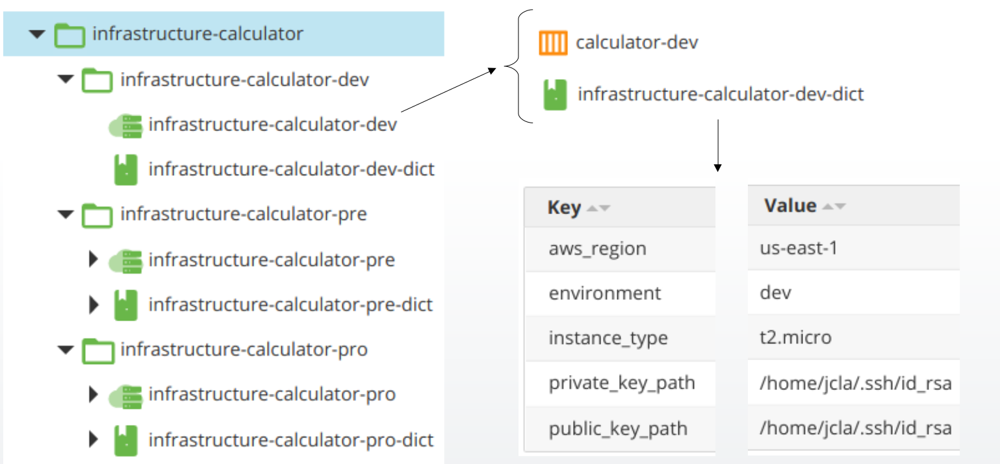

If we take a look at the content of that dictionary we will see that it is nothing more than a set of key-value pairs that will be passed as a parameter when we execute the 'terraform apply' command.

In this way, we will define several environments to provision development, pre-production and production infrastructures for, in this case, the 'calculator' project.


You can use the next yaml file to create this environments
```
---
apiVersion: xl-deploy/v1
kind: Environments
spec:
- directory: Environments/infrastructure-calculator
  children:
  - directory: infrastructure-calculator-dev
    children:
    - name: infrastructure-calculator-dev-dict
      type: udm.Dictionary
      entries:
        aws_region: eu-west-3
        environment: dev
        private_key_path: /home/jcla/.ssh/id_rsa
        instance_type: t2.micro
        public_key_path: /home/jcla/.ssh/id_rsa.pub
    - name: infrastructure-calculator-dev
      type: udm.Environment
      members:
      - Infrastructure/Terraform/terraform-host-dev/calculator-dev
      dictionaries:
      - Environments/infrastructure-calculator/infrastructure-calculator-dev/infrastructure-calculator-dev-dict
  - directory: infrastructure-calculator-pre
    children:
    - name: infrastructure-calculator-pre
      type: udm.Environment
      members:
      - Infrastructure/Terraform/terraform-host-dev/calculator-dev
      dictionaries:
      - Environments/infrastructure-calculator/infrastructure-calculator-pre/infrastructure-calculator-pre-dict
    - name: infrastructure-calculator-pre-dict
      type: udm.Dictionary
      entries:
        environment: pre
        instance_type: t2.medium
        private_key_path: /home/jcla/.ssh/id_rsa
        aws_region: eu-west-3
        public_key_path: /home/jcla/.ssh/id_rsa.pub
  - directory: infrastructure-calculator-pro
    children:
    - name: infrastructure-calculator-pro-dict
      type: udm.Dictionary
      entries:
        private_key_path: /home/jcla/.ssh/id_rsa
        aws_region: eu-west-3
        instance_type: t2.large
        public_key_path: /home/jcla/.ssh/id_rsa.pub
        environment: pro
    - name: infrastructure-calculator-pro
      type: udm.Environment
      members:
      - Infrastructure/Terraform/terraform-host-dev/calculator-dev
      dictionaries:
      - Environments/infrastructure-calculator/infrastructure-calculator-pro/infrastructure-calculator-pro-dict
```

Save it as `environments.yaml` and create the resources ...

```
xl apply -f environments.yaml
```

# Now what do we get with this approach?

Well, we can use the same version of our infrastructure to provision exactly the same environments in development, pre-production and production.

The only difference will be in the values that we have passed to the parameters.

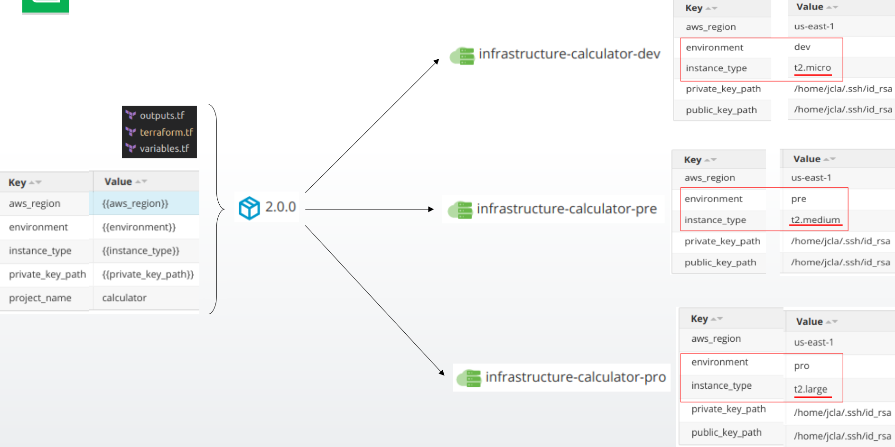

In this case we can see that the hosts we are creating for development and pre-production environments are smaller than the hosts we are creating for production. Except for this difference, the infrastructures created will be exactly the same for the three environments.

# Summary of what we need

Let's summarize what we have seen so far. In order to manage the creation of infrastructures with Terraform in XL Deploy we need:

1. Terraform modules, versioned and stored either in the Terraform Registry or in a Git repository.

<div style="text-align:center">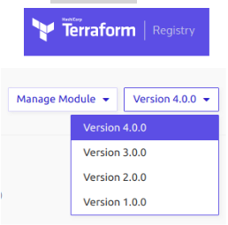</div>

2. Templates that are in charge of invoking these modules in their correct version.

<div style="text-align:center">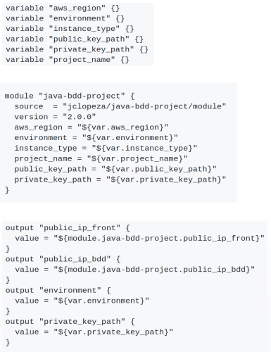</div>

3. Registration of these templates in XL Deploy together with the parameters required by that version of the module.

<div style="text-align:center">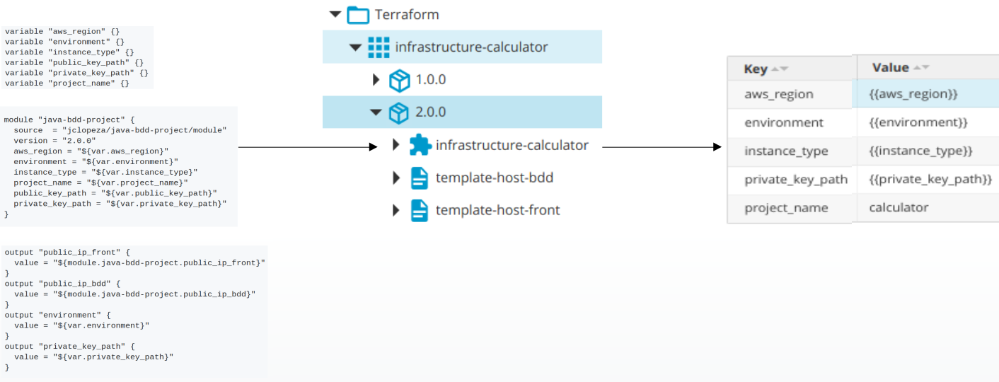</div>

4. Configuration of the access to the host that contains the credentials of the Amazon account and the Terraform client.

<div style="text-align:center">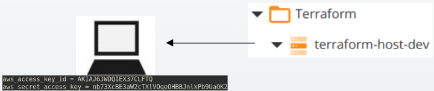</div>

5. Configuration of a Terraform client for each project and environment in which we will configure where to store the 'Terraform state' file.

<div style="text-align:center">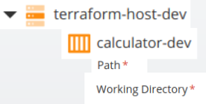</div>

6. And the creation of a deployment environment to which we will associate the Terraform client and a dictionary with the corresponding configuration.

<div style="text-align:center">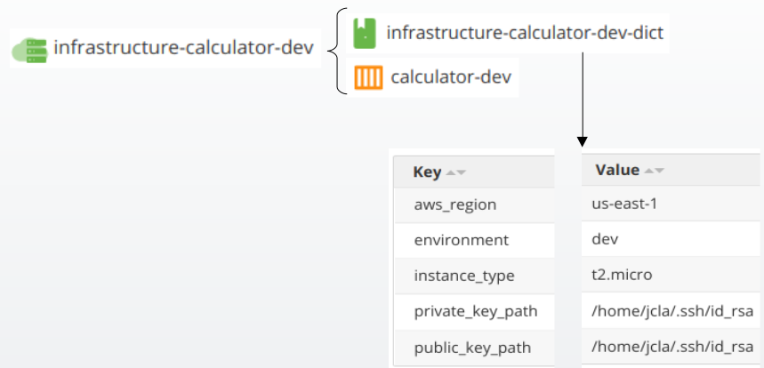</div>

7. And let XL Deploy deploy. We would just have to say that I want to use version 2.0.0 of our module to provision the development environment for the 'calculator' project.

<div style="text-align:center">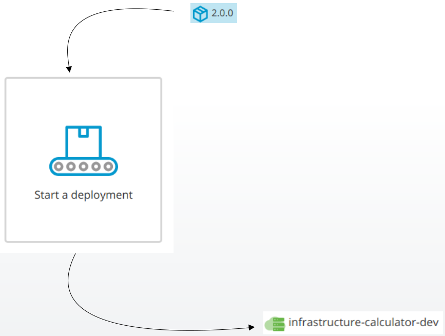</div>

# What have we achieved so far?

We have already solved many of the problems we raised at the beginning.

1. We already know what hosts to use to apply templates
2. What credentials to use
3. We know how and where to store the parameters for different environments
4. We know where to store the 'Terraform state' file for each of our infrastructures
5. We know the type of environment that we are provisioning because it is one of the parameters that I use to label the resources created in Amazon
6. We also know some information about the infrastructure created, such as the IP address of the new hosts.
7. We know how to deprovision an environment and remove it

**But it is still not enough. Keep reading ...**
