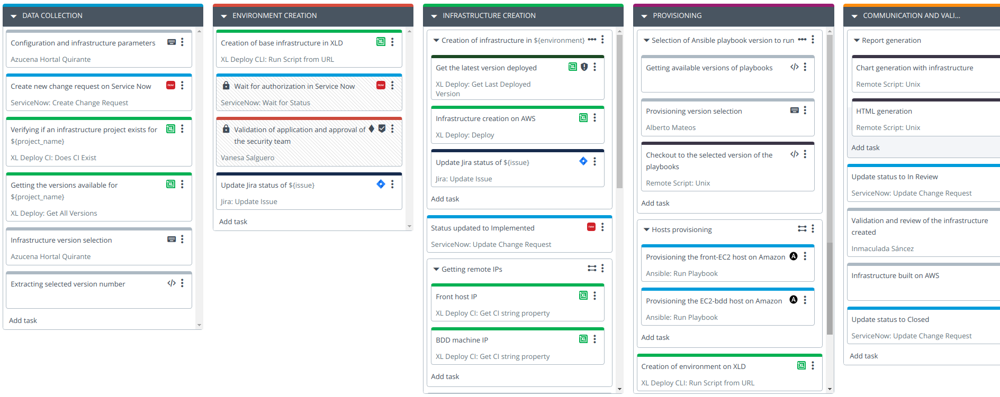

# How to rule the entire process?

We have already answered a lot of questions ... but it is not enough yet. We still have things pending. For example:

1. A way to ask, collect and store the parameters that you want to use to provision an environment.
2. Govern this process, that is, request and register in some way the request for the creation of new infrastructures.
3. A way to request and obtain authorizations from the corresponding teams before being able to provision an environment.
4. Integration with ITSM tools, such as Remedy or ServiceNow, for example.
5. Installation of the necessary software with Ansible playbooks, for example.
6. Management of notifications to communicate the availability or decommissioning of an infrastructure.

Well, to complete infrastructure management in the cloud we are going to need something else, something that allows us to orchestrate all the steps that are necessary to provision a new environment or to decommission it. And we will also do this with the DevOps platform of XebiaLabs, in this case with XL Release.

What our platform offers is a simple way to **standarize practices and processes**. Processes that must be designed by all the teams involved in the Release process, processes that will allow the knowledge of the most experienced people to land in a language that everyone understands and processes that will allow the organization to have a tool to say:

**"Look guys, you are dealing with these technologies, you are dealing with this pattern to release software, but we already have a way to deal with and manage your technology and the way you want to make that software delivery. So focus on creating new features and let us take that work to production in an agile way and respecting the standards that have been defined."**

We define these processes in what we call **templates**. The image below is the process or template that I have defined to be able to create an infrastructure on Amazon.

We can see that the process I have designed has several phases (which are the different vertical columns) and that there are a series of related tasks under each of the phases. These tasks could be manual, that is, they require someone's intervention to achieve them, or they can be automatic, such as sending an email, updating the status of a ticket in Jira, or executing a script on a remote server.

Manual tasks can be assigned to different people or teams who will be responsible for carrying them out. As you can see, it is a collaborative tool in which all the actors involved in the release intervene, which provides a global, end-to-end vision of the processes followed by the organization and which will then also allow us to improve and optimize globally.

To follow this process, starting from this model or template, I will have to create a release that will be as an instantiation of this template. There are several ways to create a release and in our case, we will do it from Jira, which will be where you register the request for a new infrastructure and the entry point that will trigger the entire process.

**Let's detail this template and let's see how to rule the process of creating a new infrastructure on the cloud for a given environment and project.**