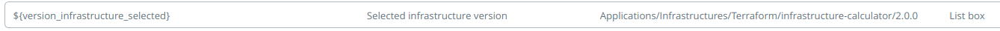

# How to get the parameters?

We are going to start designing our 'template' in XL Release.

The first step will be to collect the parameters that we are going to use to create our infrastructure. Project name, environment, AWS region, size of EC2 instances, the public and private keys that we are going to use to access them, etc.

This will be our first phase in XL Release.

## Data collection

We are going to create a first phase in XL Release in which we are going to collect the parameters with which we will invoke our Terraform templates.


### Step 1: Configuration and infrastructure parameters (User Input)

We define the following variables in our XL Release template:

* aws_region
* environment
* instance_type
* project_name
* public_key_path
* private_key_path

Some of them like 'environment', 'aws_region' or 'instance_type' can be of kind 'List box' and with fixed values.


The 'terraform apply' command will have to be executed from a host that will have to have access to the public_key_path so that it can be installed on the EC2 hosts to be created.


### Step 2: Create new change request on Service Now (ServiceNow: Create Change Request)
*To define this step, it is necessary to create an ServiceNow server under 'Settings -> Shared configuration' or under the 'Configuration' tab inside the folder where the template is located.*

We want to keep our ITSM tool updated, so we create a change request in ServiceNow. Then we will need someone to review and approve this request in ServiceNow.

We need two more variables ...


In the task details:

* Short description:
```
Request to create a new environment for ${project_name} in environment ${environment}
```
* Description
```
The following information has been provided for the creation of a new infrastructure:
1. Environment: ${environment}
2. Project: ${project_name}
3. Region AWS: ${aws_region}
4. Type of instances: ${instance_type}
5. Public and private keys: ${public_key_path} and ${private_key_path}
```


### Step 3: Verifying if an infrastructure project exists for ${project_name} (XL Deploy CI: Does CI Exist)
*To define this step, it is necessary to create an XL Deploy server under 'Settings -> Shared configuration' or under the 'Configuration' tab inside the folder where the template is located.*

In this step we make sure that there is an infrastructure project (udm.Application) created in XL Deploy for our application/project. To do this we verify that there is a CI whose ID is:

`Applications/Infrastructures/infrastructure-${project_name}`

It will be the project with the diferent versions of the Terraform templates pointing at the diferent versions of the module that we saw before.

If it does not exist, we stop the pipeline. For this we mark `Throw on Fail` as true. An improvement would be to automatically get the applications available under the `Applications/Infrastructures` folder and show them in a 'List box'.


### Step 4: Getting the versions available for ${project_name} (XL Deploy: Get All Versions)
Here we select the version of the Terraform module that we want to use to create our infrastructure.

We will get a list with the **different versions of the udm.Application availables** for the project ${project_name}. This will also be the diferent versions of the Terraform module availables (at least, it should be).

The result is stored in a variable of kind `List` and name `versions_infrastructure_availables`.


### Step 5: Infrastructure version selection (User Input)
Here we select one of the infrastructure versions available for the selected project.


The user's selection is stored in the variable of kind Listbox `${version_infrastructure_selected}`

