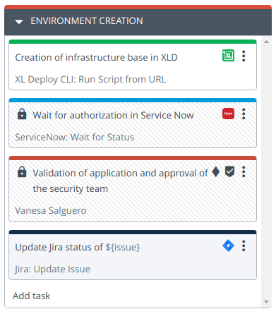
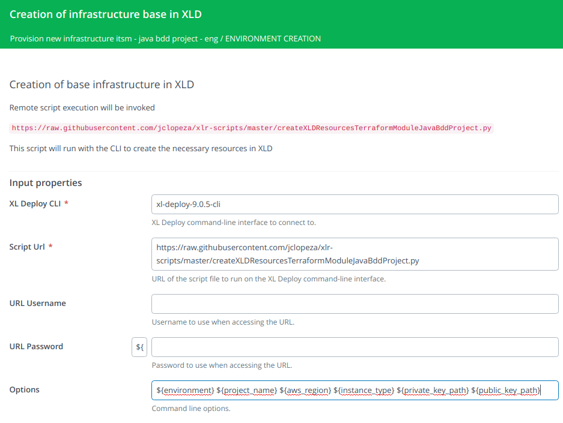
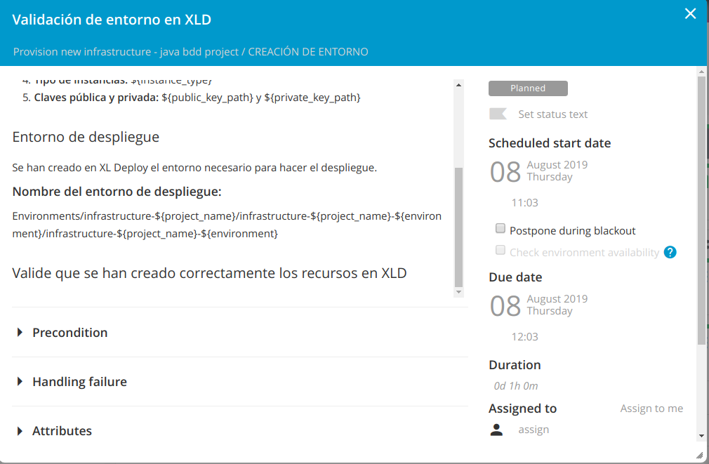
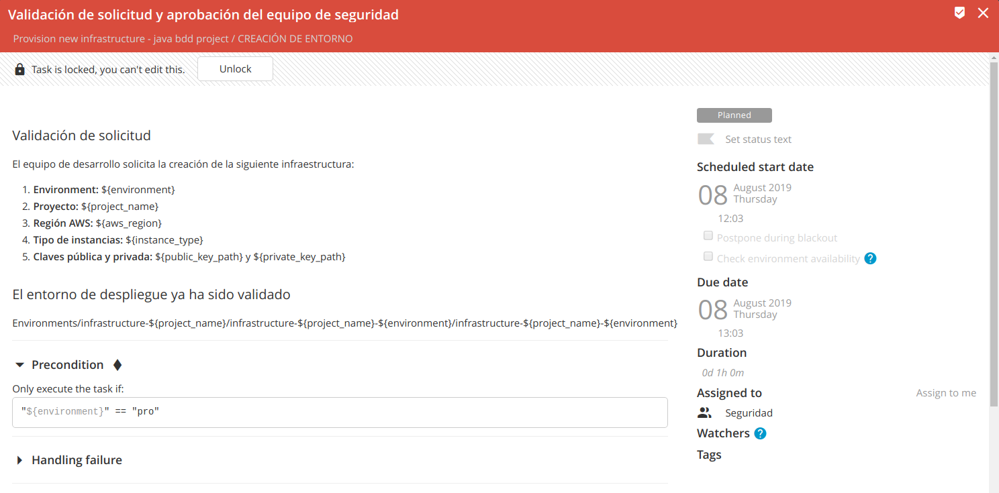

# How to create the needed resources to apply the templates?

How and from where do I execute the Terraform templates passing the necessary parameters and with the values that we have provided?

XL Deploy will take care of this. We are going to define the CIs necessary to be able to deploy this infrastructure with XL Deploy. We are going to:
* create a directory under Infrastructure named `Terraform`.
* create the host from which the Terraform templates will be executed
* create the 'Terraform client'
* create a directory under 'Environments' for the project named infrastructure-project and a new 'environment'
* create a dictionary with the values we provided
* associate the Terraform client and the dictionary to the created environment.

This will be our second phase in XL Release.

## Environment creation

We are going to create a second phase in XL Release in which the necessary CIs in XL Deploy will be created to be able to deploy our infrastructure with a Terraform client.



### Step 1: Creation of infrastructure base in XLD (XL Deploy CLI: Run Script from URL)
*To define this step, it is necessary to create an XL Deploy CLI under 'Settings -> Shared configuration' or under the 'Configuration' tab inside the folder where the template is located.*

Script URL:

`https://raw.githubusercontent.com/jclopeza/xlr-scripts/master/createXLDResourcesTerraformModuleJavaBddProject.py`

This script will run with the CLI to create the necessary resources in XLD.

The following variables will be passed in the `options` field:

```
${environment} ${project_name} ${aws_region} ${instance_type} ${private_key_path} ${public_key_path}
```



### Paso 2: Validación de entorno en XLD  (Manual)
Incluímos un paso para que se verifique que se ha creado el entorno de forma correcta en XL Deploy. Esta validación también se podría haber hecho de forma automática.

`Environments/infrastructure-${project_name}/infrastructure-${project_name}-${environment}/infrastructure-${project_name}-${environment}`



### Paso 3: Validación de solicitud y aprobación del equipo de seguridad (Gate)
Incluímos una validación adicional que sólo tendrá lugar si el entorno seleccionado es el de producción.

