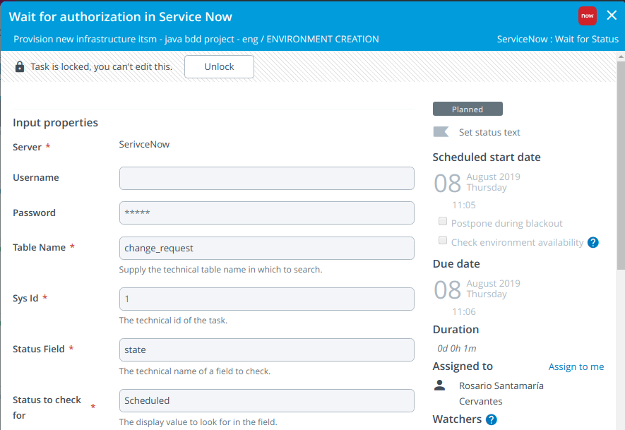
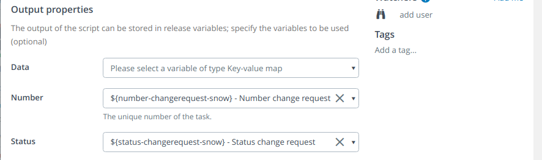
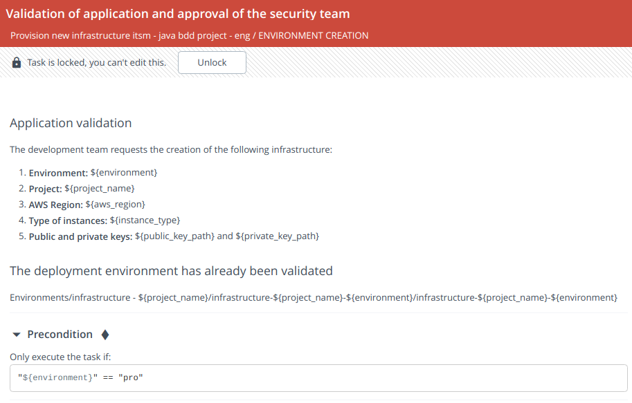
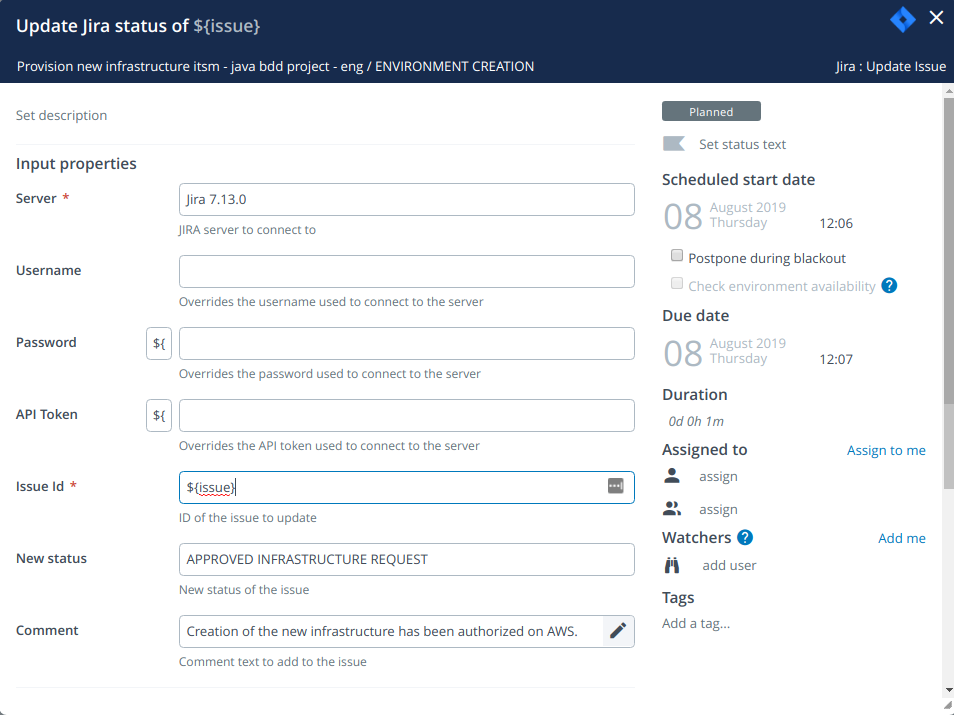

# How to create the needed resources to apply the templates?

How and from where do I execute the Terraform templates passing the necessary parameters and with the values that we have provided?

XL Deploy will take care of this. We are going to define the CIs necessary to be able to deploy this infrastructure with XL Deploy. We are going to:
* create a directory under Infrastructure named `Terraform`.
* create the host from which the Terraform templates will be executed
* create the 'Terraform client'
* create a directory under 'Environments' for the project named infrastructure-project and a new 'environment'
* create a dictionary with the values we provided
* associate the Terraform client and the dictionary to the created environment.

This will be our second phase in XL Release.

## Environment creation

We are going to create a second phase in XL Release in which the necessary CIs in XL Deploy will be created to be able to deploy our infrastructure with a Terraform client.


### Step 1: Creation of infrastructure base in XLD (XL Deploy CLI: Run Script from URL)
*To define this step, it is necessary to create an XL Deploy CLI under 'Settings -> Shared configuration' or under the 'Configuration' tab inside the folder where the template is located.*

Script URL:

`https://raw.githubusercontent.com/jclopeza/xlr-scripts/master/createXLDResourcesTerraformModuleJavaBddProject.py`

This script will run with the CLI to create the necessary resources in XLD.

The following variables will be passed in the `options` field:

```
${environment} ${project_name} ${aws_region} ${instance_type} ${private_key_path} ${public_key_path}
```


*This can also be done using `xl apply -f ...`*

### Step 2: Wait for authorization in Service Now (ServiceNow: Wait for Status)

Now someone has to acces to ServiceNow and approve the change request that we created earlier. This is an easy way to show how to get remote authorizations in our process.

Here we have:
* to use the `${sysId-changerequest-snow}` variable in the `Sys Id` field
* to set the value `state` in the `Status Field` field
* to set the value `Scheduled` in the `Status to check for` field





We can complete the `Output properties` but it is not necesary.

### Step 3: Validation of application and approval of the security team (Gate)

We include an additional validation that will only take place if the selected environment is the production one.



### Step 4: Update Jira status of ${issue} (Jira: Update Issue)
*To define this step, it is necessary to create a Jira Server under 'Settings -> Shared configuration' or under the 'Configuration' tab inside the folder where the template is located.*

Here we update the issue in Jira. This template will be triggered from Jira, and this step will update the status of the issue to `APPROVED INFRASTRUCTURE REQUEST`.

Here we have:
* to use the `${issue}` variable in the `Issue Id` field
* to set the value `APPROVED INFRASTRUCTURE REQUEST` in the `New status` field


