# How do I start the execution?
How do I start the execution of the Terraform templates?

We already have everything necessary to start this deployment. We have the Deployment Package in XL Deploy and the 'environment' that we just created dynamically (configured with a Terraform client and a dictionary with all the parameters that have to be applied).

This will be our third phase in XL Release.

## INFRASTRUCTURE CREATION

We are going to create a third phase in XL Release in which we are going to launch the execution of the templates.

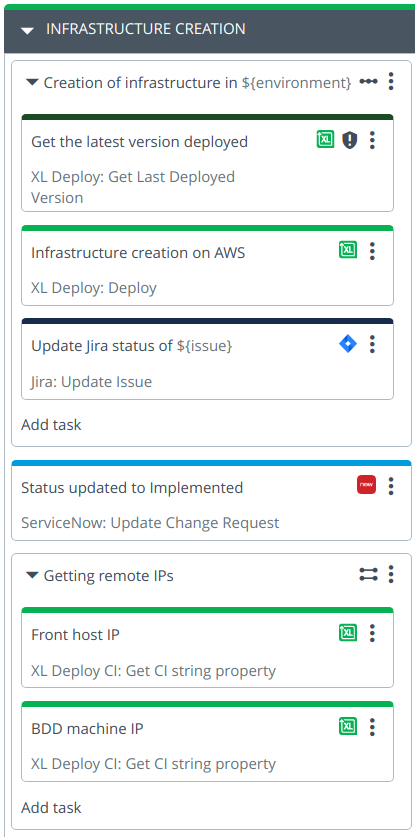

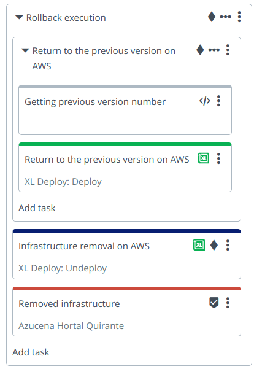

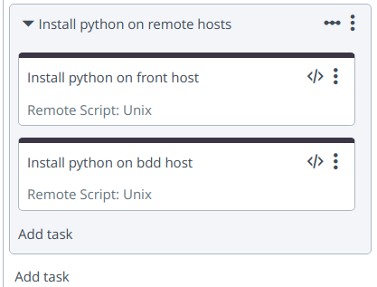

### Step 1: Creation of infrastructure in ${environment} (Core: Sequential Group)

### Step 1.1: Get the latest version deployed (XL Deploy: Get Last Deployed Version)

We have to get the latest version deployed in case we later decide to rollback the applied changes.

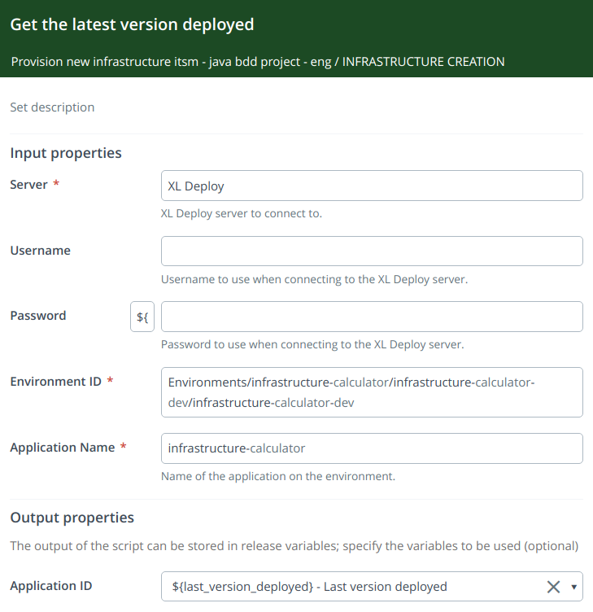

We have to use the next parameters:
* **Environment ID**: Environments/infrastructure-${project_name}/infrastructure-${project_name}-${environment}/infrastructure-${project_name}-${environment}
* **Application Name**: infrastructure-${project_name}

Output properties:
* **Application ID**: ${last_version_deployed}

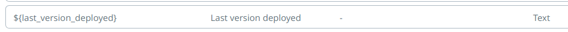

On this parameter, we set the default value to '-'.

### Step 1.2: Infrastructure creation on AWS (XL Deploy: Deploy)

It is about indicating what we want to deploy and where, that is, facilitating the Deployment Package and the target environment.

* In the `Package` field we will have to indicate the version we want to deploy: `${version_infrastructure_selected}`
* In the `Environment` field the environment that we created dinamically in the previous steps: `Environments/infrastructure-${project_name}/infrastructure-${project_name}-${environment}/infrastructure-${project_name}-${environment}`

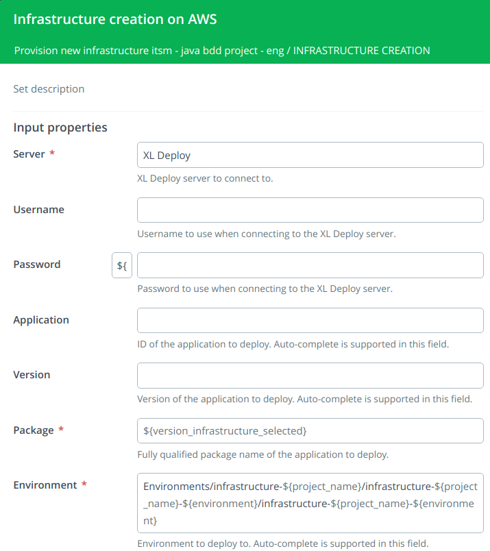

### Step 1.3: Update Jira status of ${issue} (Jira: Update Issue)
This step will update the status of the issue to `INFRASTRUCTURE PROVIDED`.

Here we have:
* to use the `${issue}` variable in the `Issue Id` field
* to set the value `INFRASTRUCTURE PROVIDED` in the `New status` field

We can also add some comments to this issue:
```
New provisioned infrastructure:

1. Environment: ${environment}
2. Project: ${project_name}
3. AWS Region: ${aws_region}
4. Type of instances: ${instance_type}
5. Public and private keys: ${public_key_path} and ${private_key_path}

The environment necessary to deploy has been created in XL Deploy. Deployment environment name:

Environments/infrastructure-${project_name}/infrastructure-${project_name}-${environment}/infrastructure-${project_name}-${environment}
```

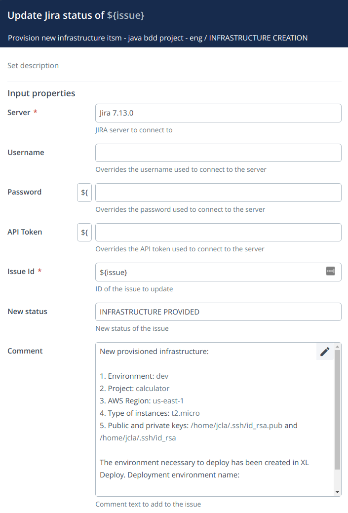

### Step 2: Status updated to Implemented (ServiceNow: Update Change Request)
This step will update the status of the change request in ServiceNow to `Implemented`.

We have to use the next parameters:
* **State**: Implement
* **Sys Id**: ${sysId-changerequest-snow}

Output properties:
* **Number**: ${number-changerequest-snow}

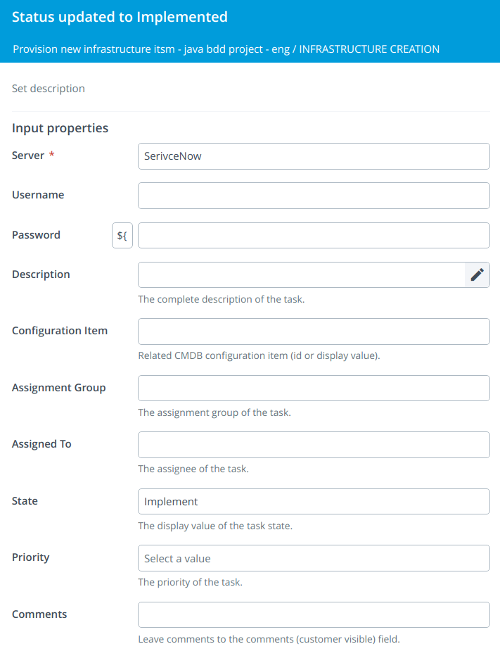

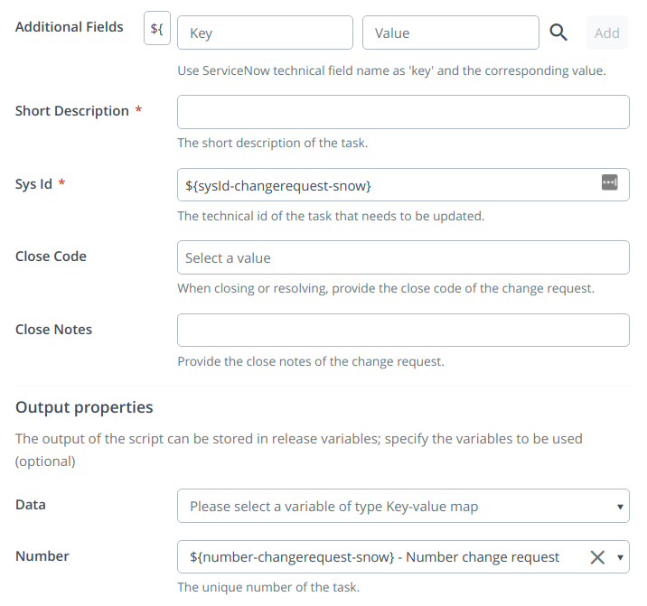


### Step 3: Getting remote IPs (Core: Parallel Group)

When the infrastructure is created with XL Deploy and Terraform, two CIs of the overthere.SshHost type are also automatically created and registered in XL Deploy with the information necessary to access the new EC2 instances created. That is, the IP address, operating system, user and the location of the private key to access them.

**The private key provided as a parameter in the first phase of XL Release must be accessible from the server where XL Deploy is running.**

With this task, what we are going to do is recover those IP addresses and then be able to provision these two EC2 instances.

We know the name that the hosts are going to have in XL Deploy (the name is indicated in the templates), therefore it is very easy to access their attributes.

We will use these variables as outputs variables:

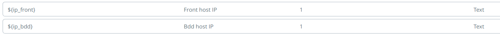

### Step 3.1: Front host IP (XL Deploy CI: Get CI string property)

We have to use the next parameters:
* **CI ID**: Infrastructure/${project_name}-${environment}-front
* **Property name**: address

Output properties:
* **Property value**: ${ip_front}

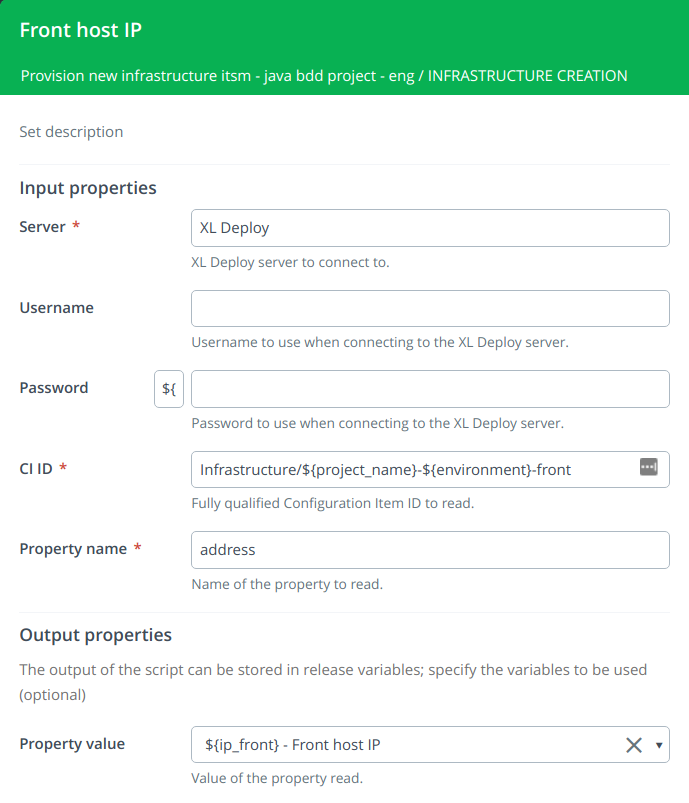

### Step 3.2: BDD host IP (XL Deploy CI: Get CI string property)

We have to use the next parameters:
* **CI ID**: Infrastructure/${project_name}-${environment}-bdd
* **Property name**: address

Output properties:
* **Property value**: ${ip_bdd}

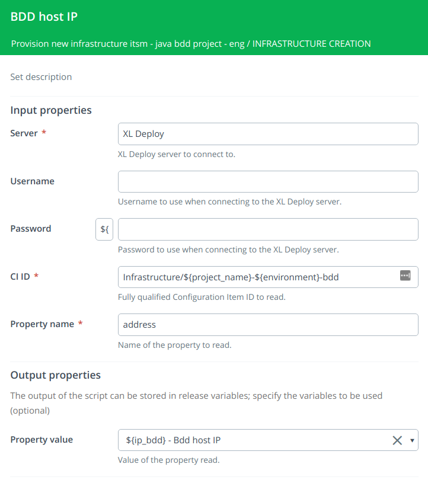

### Step 4: Continue with the provisioning process? (Iser Input)

The new infrastructure on Amazon has already been provisioned. Now someone has to review it and decide whether continue with the provisioning process or not.

We need a new variable called `actions` of kind Listbox and with two fixed values.

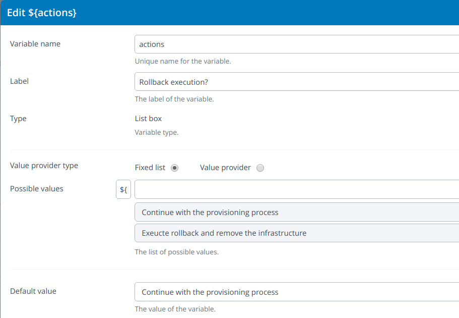

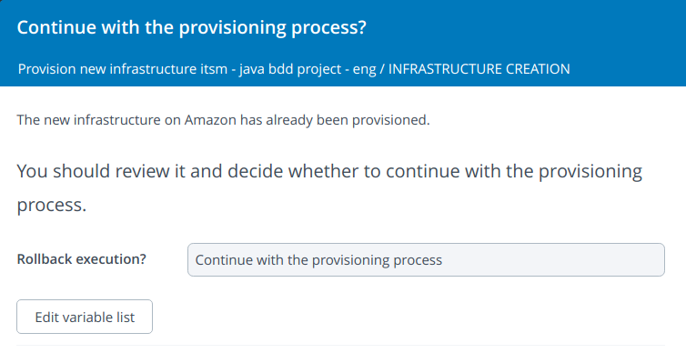

### Step 5: Rollback execution (Core: Sequential Group)

These steps will be executed only if we choose the option "Exeucte rollback and remove the infrastructure" in the previous step. It's a conditional block.

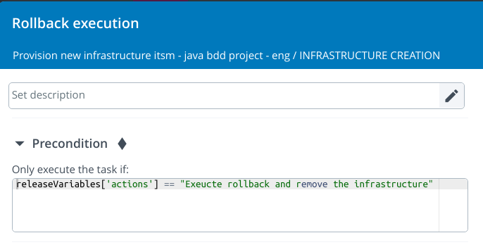

