# How to provision the new infrastructure?

We have created our infrastructure in Amazon (two EC2 instances) and we have created two new hosts in XL Deploy with the IP addresses and other information necessary to access them.

Now we want to install the necessary middleware on these hosts to be able to run our applications (tomcat, mysql-server, etc.).

It would be nice if the Ansible playbooks that we are goint to use for provisioning were versioned and that we had the opportunity to select which version of the playbooks we want to use to install the middleware on our EC2 instances.

This will be our fourth phase in XL Release.

## Provisioning

We are going to create a fourth phase in XL Release in which we are going to provision our newly created EC2 instances.

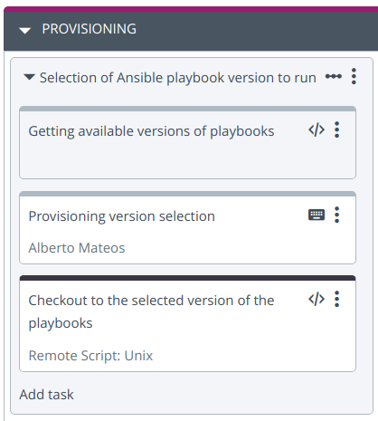

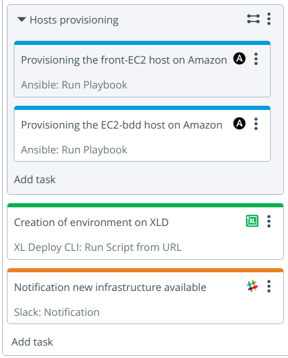

### Step 1: Selection of Ansible playbook version to run (Core: Sequential Group)

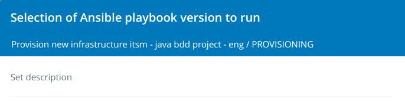

### Step 1.1: Obtención de las versiones disponibles de playbooks (Script: Jython Script)

In the following Git repository, we have the Ansible playbooks with the different roles that are needed to provision the new EC2 instances `https://github.com/jclopeza/playbooks-provisioning`

Different versions are available in this repository. The first step will be to get all available versions. We do it with the following code:
```
import urllib2
import json
import base64
req = urllib2.Request('https://api.github.com/repos/jclopeza/playbooks-provisioning/tags')
listTags = []
req.add_header('Content-Type','application/json')
response = urllib2.urlopen(req)
data = json.loads(response.read())
for i in data:
    listTags = listTags + [i['name']]
releaseVariables['list_tags'] = listTags
```

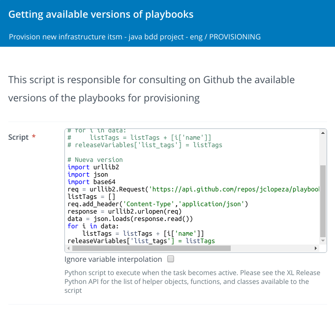

We store the available versions in the variable `list_tags`

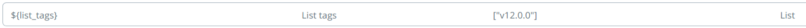

### Step 1.2: Provisioning version selection (User Input)

This step shows all the existing versions in the Git repository for the user to select which one they want to use to provision EC2 instances.

The versions were obtained in the previous step.

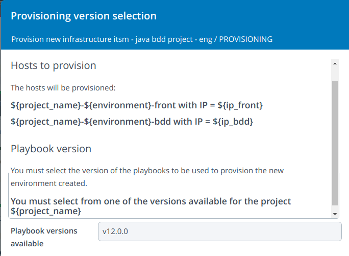

The selection is stored in the variable `${tag_ansible_selected}`

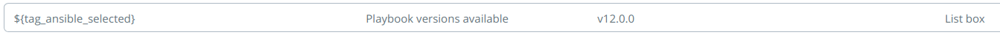

### Step 1.3: Checkout to the selected version of the playbooks (Remote Script: Unix)

In this step we clone the Git repository with Ansible playbooks and checkout the previously selected version.

```
cd /tmp && rm -fr playbooks-provisioning
git clone https://github.com/jclopeza/playbooks-provisioning.git
cd playbooks-provisioning
git checkout ${tag_ansible_selected}
```

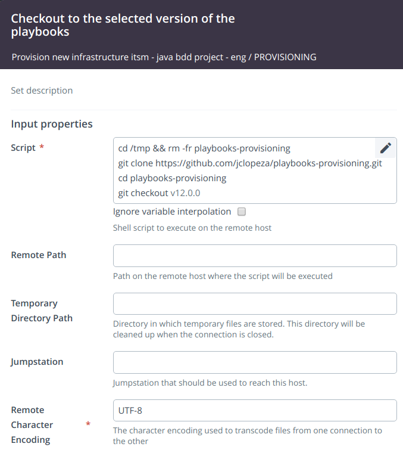

### Paso 4: Provisioning de la instancia-front/bdd EC2 en Amazon (Ansible: Run Playbook)

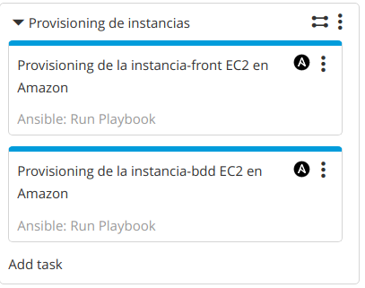

*Para definir este step, es necesario crear un servidor de tipo Unix Host remoto que será desde el que se ejecuten los playbooks, sería la máquina de control de Ansible. Bajo 'Settings -> Shared configuration' o bajo la pestaña 'Configuration' dentro de la carpeta en la que se ubique la template se debe crear un Unix Host.*

Tenemos los playbooks en el directorio `/tmp/playbooks-provisioning`. Tenemos que provisionar la instancia 'front' y la instancia 'bdd'. Habrá que ejecutar para la parte front:
* Playbook Path: `/tmp/playbooks-provisioning/playbook-front.yml`
* Additional command line parameters: `-u ubuntu -i "${ip_front}," --private-key "${private_key_path}" --ssh-common-args="-o StrictHostKeyChecking=no" -e "public_key_path=${public_key_path}"`

Y para la parte bdd:
* Playbook Path: `/tmp/playbooks-provisioning/playbook-bdd.yml`
* Additional command line parameters: `-u ubuntu -i "${ip_bdd}," --private-key "${private_key_path}" --ssh-common-args="-o StrictHostKeyChecking=no"`

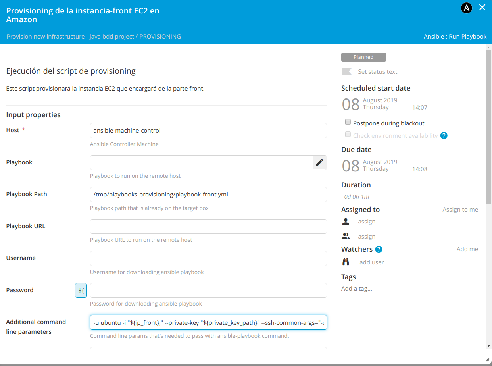

### Paso 5: Creación de entorno en XLD (XL Deploy CLI: Run Script from URL)
Ya tenemos nuestras instancias EC2 con todo el middleware instalado. Ahora vamos a informar a XL Deploy de este nuevo middleware para que podamos ser capaces de desplegar nuevas aplicaciones en él.

Se ejecutará:
* el script: `https://raw.githubusercontent.com/jclopeza/xlr-scripts/master/createXLDResourcesTerraformModuleJavaBddProjectContainers.py`
* con las opciones: `${environment} ${project_name} ${ip_front} ${ip_bdd}`

Esto creará nuevos containers bajo los hosts creados en XL Deploy:
* axis2.Deployer
* tomcat.Server
* tomcat.VirtualHost
* smoketest.Runner
* sql.MySqlClient

Creará un nuevo diccionario:
* ip_front
* ip_bdd

Creará un nuevo entorno con los containers y el diccionario asociado.

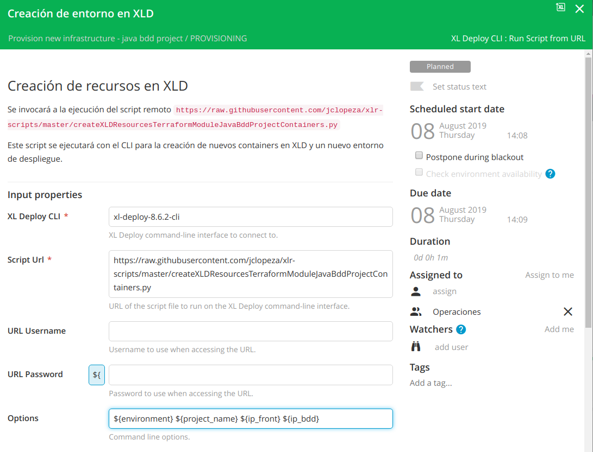

### Paso 6: Notificación a desarrollo de nuevo entorno disponible (Notification)
Notificación al equipo de desarrollo de que se ha creado el nuevo entorno para que puedan desplegarse las aplicaciones correspondientes.

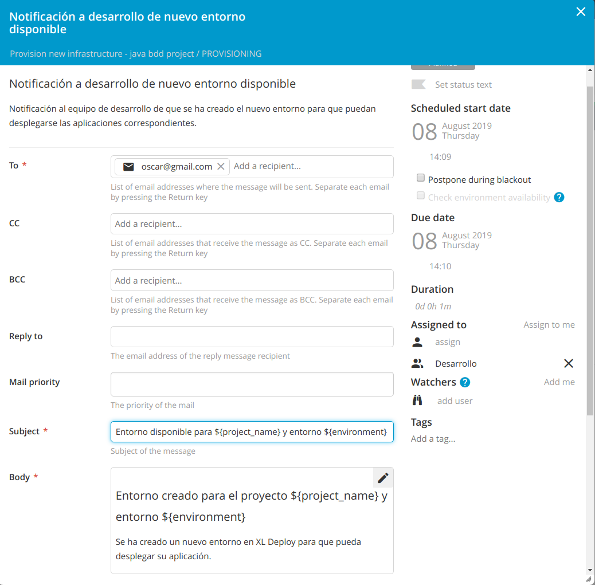