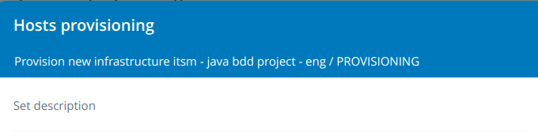
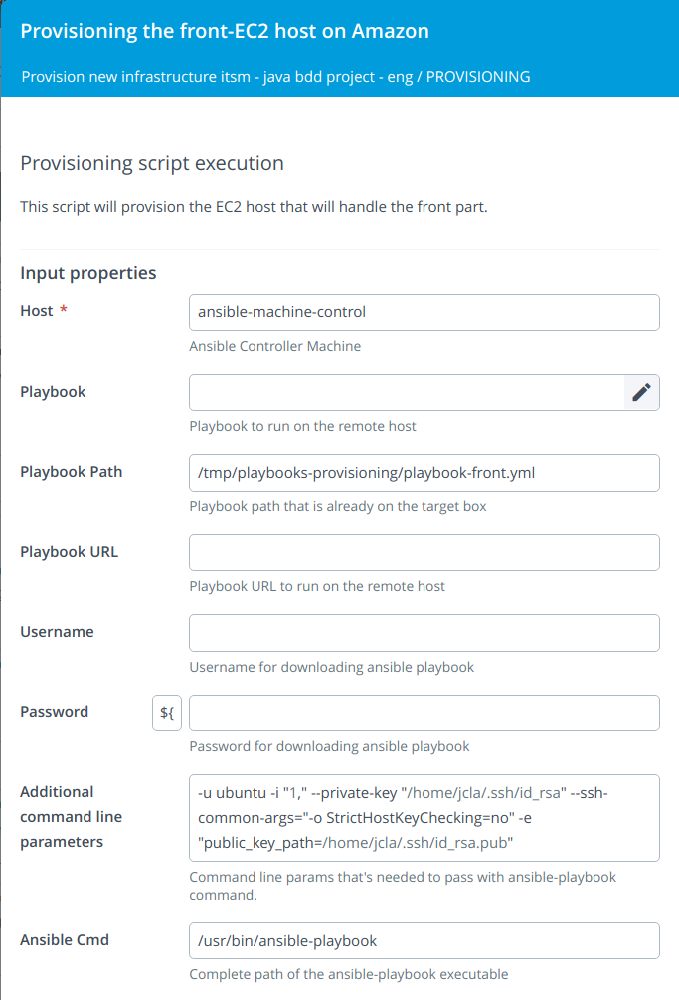
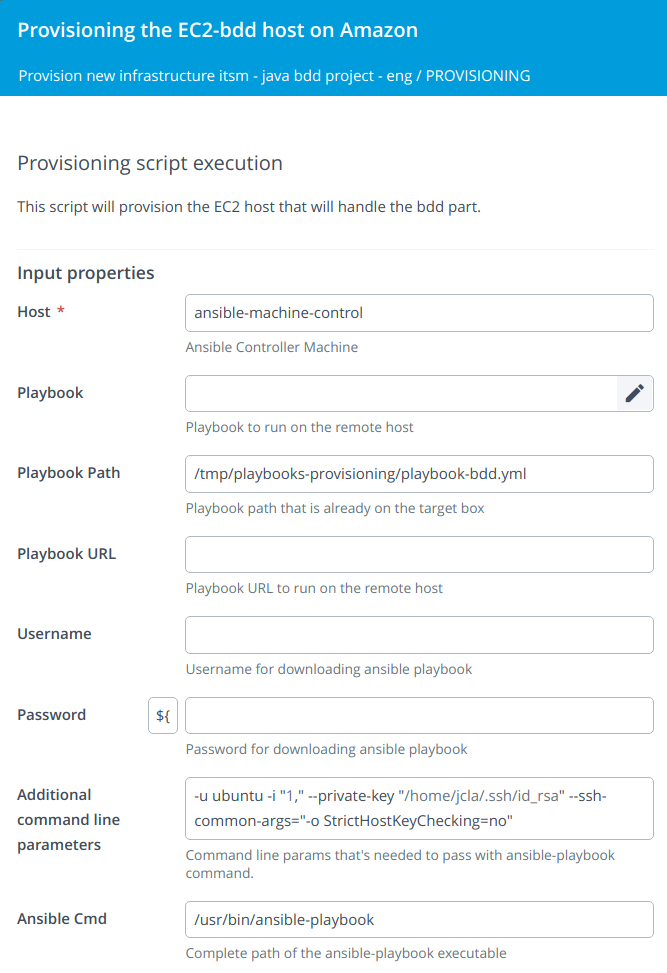
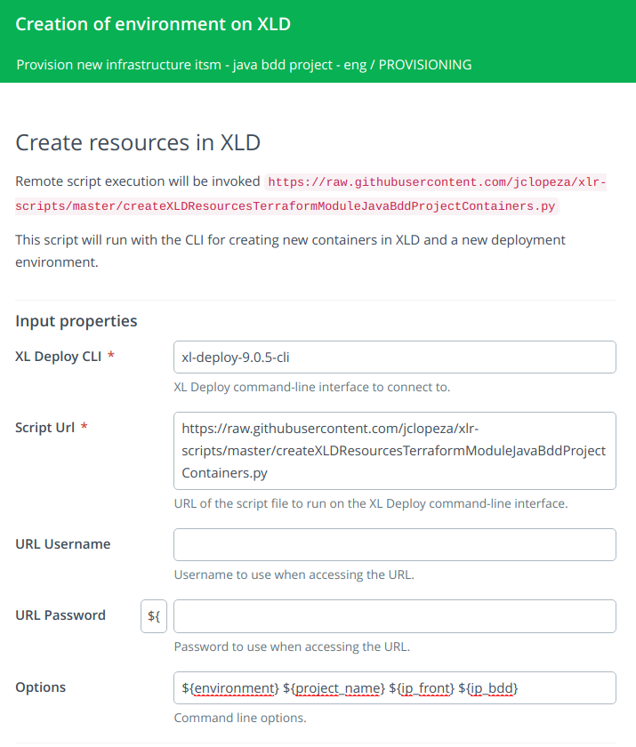
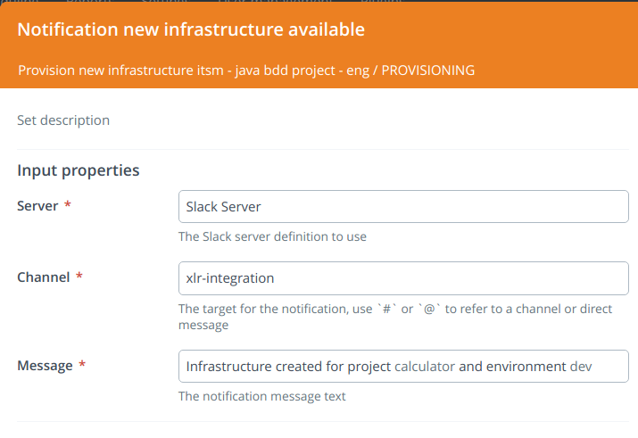

# How to provision the new infrastructure?

We have created our infrastructure in Amazon (two EC2 instances) and we have created two new hosts in XL Deploy with the IP addresses and other information necessary to access them.

Now we want to install the necessary middleware on these hosts to be able to run our applications (tomcat, mysql-server, etc.).

It would be nice if the Ansible playbooks that we are goint to use for provisioning were versioned and that we had the opportunity to select which version of the playbooks we want to use to install the middleware on our EC2 instances.

This will be our fourth phase in XL Release.

## Provisioning

We are going to create a fourth phase in XL Release in which we are going to provision our newly created EC2 instances.


### Step 1: Selection of Ansible playbook version to run (Core: Sequential Group)


### Step 1.1: Getting available versions of playbooks (Script: Jython Script)

In the following Git repository, we have the Ansible playbooks with the different roles that are needed to provision the new EC2 instances `https://github.com/jclopeza/playbooks-provisioning`

Different versions are available in this repository. The first step will be to get all available versions. We do it with the following code:
```
import urllib2
import json
import base64
req = urllib2.Request('https://api.github.com/repos/jclopeza/playbooks-provisioning/tags')
listTags = []
req.add_header('Content-Type','application/json')
response = urllib2.urlopen(req)
data = json.loads(response.read())
for i in data:
    listTags = listTags + [i['name']]
releaseVariables['list_tags'] = listTags
```


We store the available versions in the variable `list_tags`


### Step 1.2: Provisioning version selection (User Input)

This step shows all the existing versions in the Git repository for the user to select which one they want to use to provision EC2 instances.

The versions were obtained in the previous step.


The selection is stored in the variable `${tag_ansible_selected}`


### Step 1.3: Checkout to the selected version of the playbooks (Remote Script: Unix)

In this step we clone the Git repository with Ansible playbooks and checkout the previously selected version.

```
cd /tmp && rm -fr playbooks-provisioning
git clone https://github.com/jclopeza/playbooks-provisioning.git
cd playbooks-provisioning
git checkout ${tag_ansible_selected}
```


### Step 2: Hosts provisioning (Core: Parallel Group)

Now we run the playbooks to provision the new instances.




### Step 2.1: Provisioning the front-EC2 host on Amazon (Ansible: Run Playbook)

*To define this step, it is necessary to create a remote Unix Host type server that will be the one from which the playbooks are run, it would be the Ansible control machine. Under 'Settings -> Shared configuration' or under the 'Configuration' tab within the folder where the template is located, a Unix Host must be created.*

We have the playbooks in the `/tmp/playbooks-provisioning` directory and to provision the 'front' instance.

We will have to use the next parameters:

* Playbook Path: `/tmp/playbooks-provisioning/playbook-front.yml`
* Additional command line parameters: `-u ubuntu -i "${ip_front}," --private-key "${private_key_path}" --ssh-common-args="-o StrictHostKeyChecking=no" -e "public_key_path=${public_key_path}"`




### Step 2.2: Provisioning the EC2-bdd host on Amazon (Ansible: Run Playbook)

We have the playbooks in the `/tmp/playbooks-provisioning` directory and to provision the 'bdd' instance.

We will have to use the next parameters:

* Playbook Path: `/tmp/playbooks-provisioning/playbook-bdd.yml`
* Additional command line parameters: `-u ubuntu -i "${ip_bdd}," --private-key "${private_key_path}" --ssh-common-args="-o StrictHostKeyChecking=no"`




### Step 3: Creation of environment on XLD (XL Deploy CLI: Run Script from URL)

We already have our EC2 instances with all the middleware installed. Now we are going to let XL Deploy be aware of this new middleware so that we can be able to deploy new applications on it.

We will have to use the next parameters:

* Script Url: `https://raw.githubusercontent.com/jclopeza/xlr-scripts/master/createXLDResourcesTerraformModuleJavaBddProjectContainers.py`
* Options: `${environment} ${project_name} ${ip_front} ${ip_bdd}`

This will create new containers under the hosts created in XL Deploy:
* axis2.Deployer
* tomcat.Server
* tomcat.VirtualHost
* smoketest.Runner
* sql.MySqlClient

And it will create a new dictionary:
* ip_front
* ip_bdd

It will also create a new environment with the containers and the associated dictionary.



### Step 4: Notification new infrastructure available (Slack: Notification)

*To define this step, it is necessary to create a Slack Server. Under 'Settings -> Shared configuration' or under the 'Configuration' tab within the folder where the template is located.*

Notification to the slack channel that the new environment has been created so that the corresponding applications can be deployed.

We will have to use the next parameters:

* Channel: `the Slack channel name`
* Message: `Infrastructure created for project ${project_name} and environment ${environment}`

