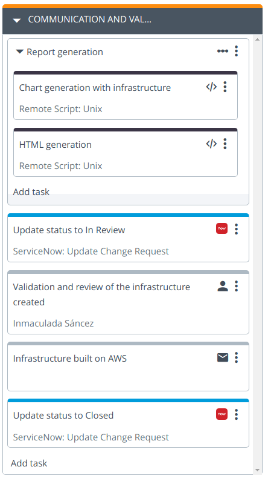
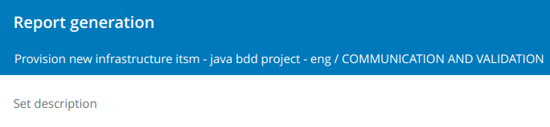
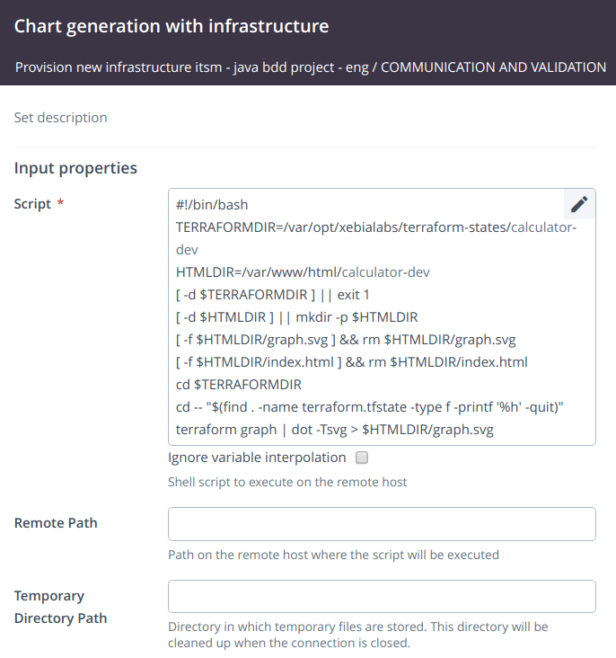
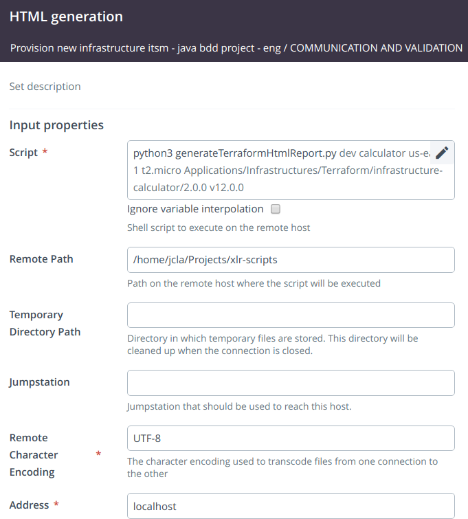
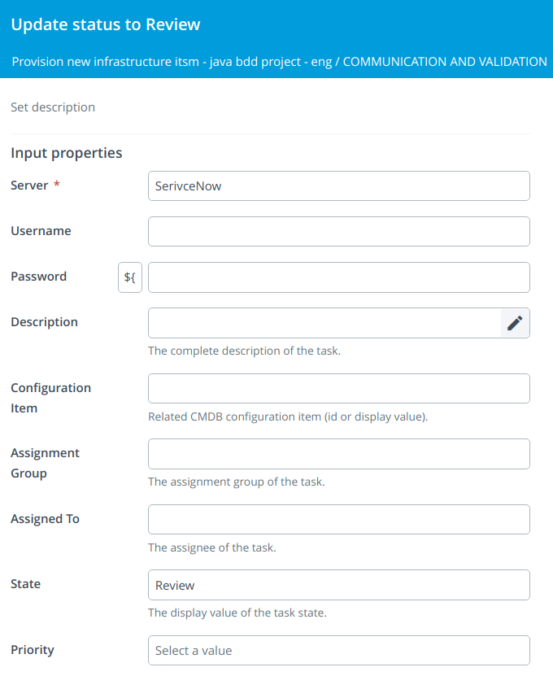
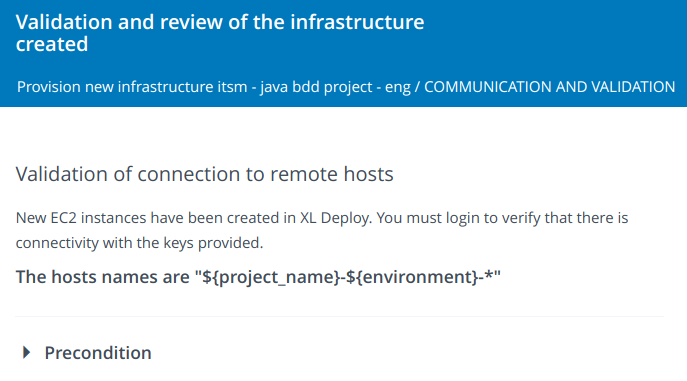
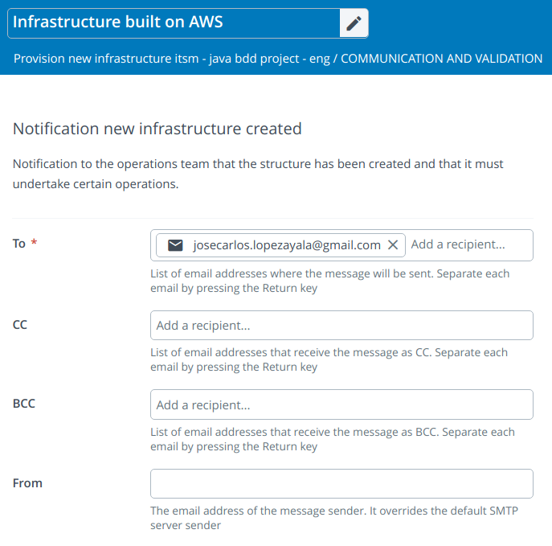
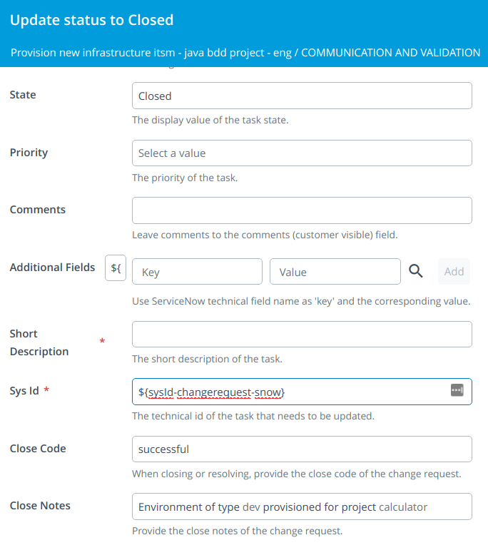

# How to notify that there is a new infrastructure available?

We have our infrastructure created on Amazon and now I want to notify its availability, generate graphics, indicate the versions of the Terraform templates with which they have been generated, the version of the Ansible playbooks used, etc.

This will be our fifth phase in XL Release.

## Communication and Validation

We are going to create a fifth phase in XL Release in which we are going to generate a report with the created infrastructure and we are going to make it known.



### Step 1: Report generation (Core: Sequential Group)

Let's generate some reports about the infrastructure.



### Step 1.1: Chart generation with infrastructure (Remote Script: Unix)
We are going to generate a graph with the structure created. To do this we run the following script:

```
#!/bin/bash
TERRAFORMDIR=/var/opt/xebialabs/terraform-states/${project_name}-${environment}
HTMLDIR=/var/www/html/${project_name}-${environment}
[ -d $TERRAFORMDIR ] || exit 1
[ -d $HTMLDIR ] || mkdir -p $HTMLDIR
[ -f $HTMLDIR/graph.svg ] && rm $HTMLDIR/graph.svg
[ -f $HTMLDIR/index.html ] && rm $HTMLDIR/index.html
cd $TERRAFORMDIR
cd -- "$(find . -name terraform.tfstate -type f -printf '%h' -quit)"
terraform graph | dot -Tsvg > $HTMLDIR/graph.svg
```



You need Nginx up and running and a virtual host pointing at `/var/www/html/` to serve the reports.

### Step 1.2: HTML generation (Remote Script: Unix)

In this step we are going to execute a script in Python that is going to be in charge of generating an HTML with the information related to the infrastructure.

We will execute the next script:

```
python3 generateTerraformHtmlReport.py ${environment} ${project_name} ${aws_region} ${instance_type} ${version_infrastructure_selected} ${tag_ansible_selected}
```



Under `Remote Path` we have to indicate the directory where the `generateTerraformHtmlReport.py` script is located. This script can be found here:

`https://raw.githubusercontent.com/jclopeza/xlr-scripts/master/generateTerraformHtmlReport.py`

It will process a template and place it in a directory accessible by a `Nginx` server.


### Step 2: Status updated to Review (ServiceNow: Update Change Request)

This step will update the status of the change request in ServiceNow to `Review`.

We have to use the next parameters:
* **State**: Review
* **Sys Id**: ${sysId-changerequest-snow}

Output properties:
* **Number**: ${number-changerequest-snow}




### Step 3: Validation and review of the infrastructure created (Manual)

In this step we are going to validate that we can establish connection to the EC2 instances created in Amazon from the infrastructure CIs that were created in XL Deploy of type overthere.SshHost



### Step 4: Infrastructure built on AWS (Core: Notification)
In this second to last step, we will send an email with the information of the created infrastructure and a link to the HTML report generated in the previous step.

The content of the message is as follows:

```
### Provisioned infrastructure for project ${project_name} and environment ${environment}

New infrastructure has been created on AWS. Remember that:

* Must enable monitoring
* You must set consumption alerts
* You must notify any anomaly or service outage to the address Sistemas@gmail.com

These are the data related to infrastructure:

1. **Environment:** ${environment}
2. **Project:** ${project_name}
3. **AWS Region:** ${aws_region}
4. **Type of instances:** ${instance_type}
5. **Public and private keys:** ${public_key_path} and ${private_key_path}

You can also consult the [graphic of the created structure](http://localhost/${project_name}-${environment}).
```



### Step 5: Status updated to Closed (ServiceNow: Update Change Request)

This step will update the status of the change request in ServiceNow to `Closed`.

We have to use the next parameters:
* **State**: Closed
* **Sys Id**: ${sysId-changerequest-snow}
* **Close Code**: successful
* **Close Notes**: Environment of type ${environment} provisioned for project ${project_name}

Output properties:
* **Number**: ${number-changerequest-snow}


